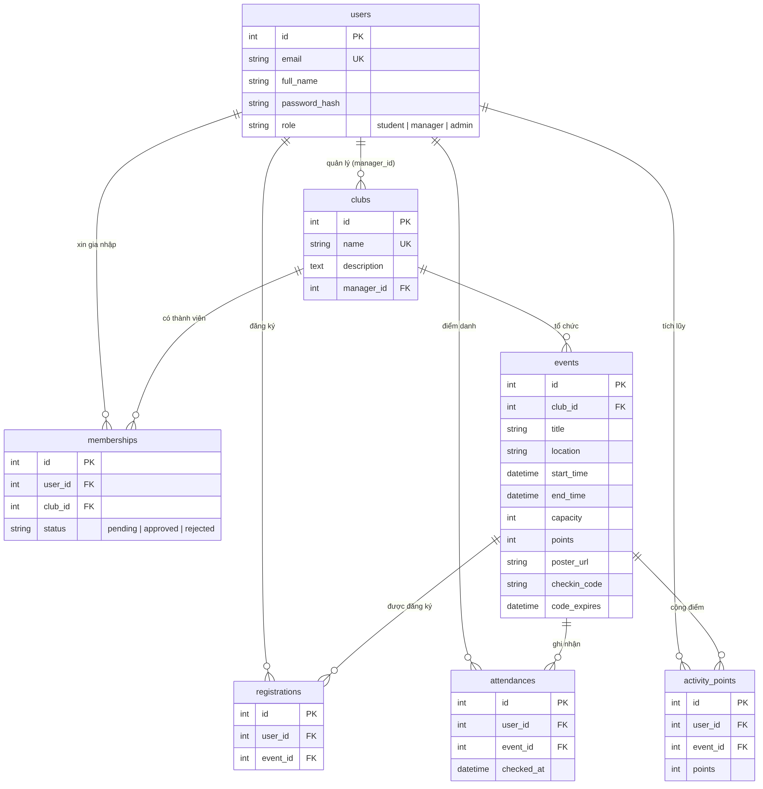
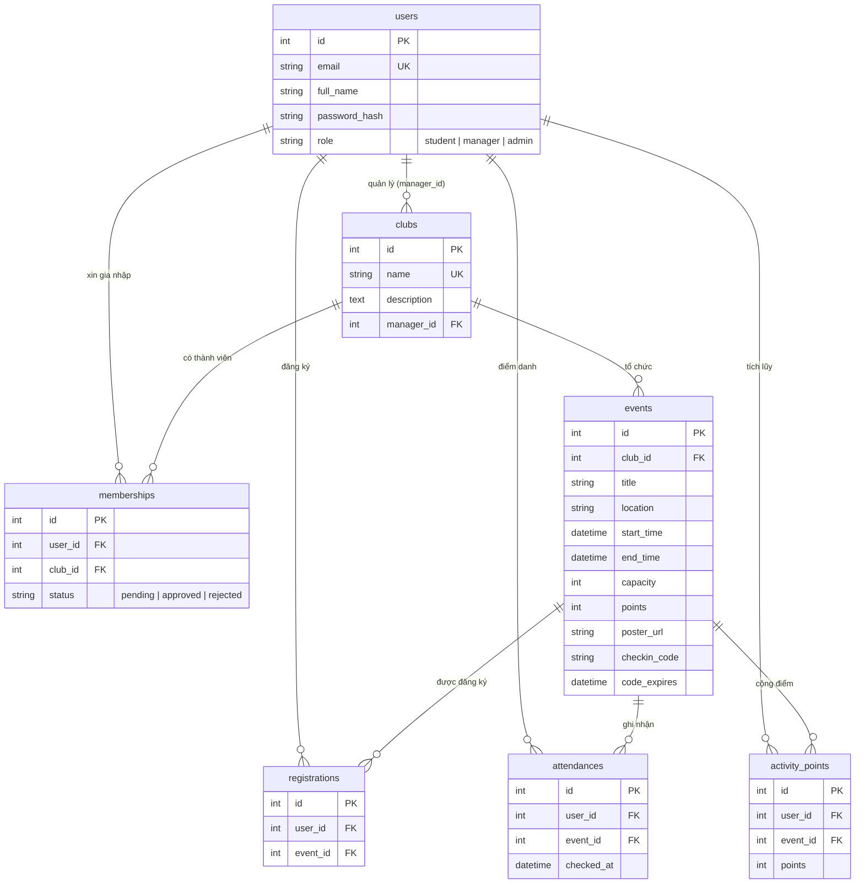

# ERD – Cơ sở dữ liệu

7 bảng. Quan hệ 1:N: users → clubs (manager_id), clubs → events. Quan hệ N:N: users ↔ clubs qua memberships, users ↔ events qua registrations và attendances.

```mermaid
erDiagram
    users ||--o{ clubs : "quản lý (manager_id)"
    users ||--o{ memberships : "xin gia nhập"
    clubs ||--o{ memberships : "có thành viên"
    clubs ||--o{ events : "tổ chức"
    users ||--o{ registrations : "đăng ký"
    events ||--o{ registrations : "được đăng ký"
    users ||--o{ attendances : "điểm danh"
    events ||--o{ attendances : "ghi nhận"
    users ||--o{ activity_points : "tích lũy"
    events ||--o{ activity_points : "cộng điểm"

    users {
        int id PK
        string email UK
        string full_name
        string password_hash
        string role "student | manager | admin"
    }
    clubs {
        int id PK
        string name UK
        text description
        int manager_id FK
    }
    memberships {
        int id PK
        int user_id FK
        int club_id FK
        string status "pending | approved | rejected"
    }
    events {
        int id PK
        int club_id FK
        string title
        string location
        datetime start_time
        datetime end_time
        int capacity
        int points
        string poster_url
        string checkin_code
        datetime code_expires
    }
    registrations {
        int id PK
        int user_id FK
        int event_id FK
    }
    attendances {
        int id PK
        int user_id FK
        int event_id FK
        datetime checked_at
    }
    activity_points {
        int id PK
        int user_id FK
        int event_id FK
        int points
    }
```
